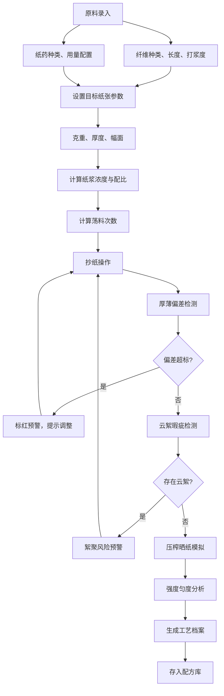

## 1. 产品概述

本系统是面向传统手工造纸工艺的专业生产力工具，为手工纸抄造匠人提供纸浆配比计算、帘纹厚薄控制、工艺参数管理的一体化解决方案。系统融合传统造纸经验与现代计算方法，实现从原料到成纸的全流程数字化管理。

- **核心目标**：解决手工造纸依赖经验、参数难以量化、质量波动大的行业痛点
- **目标用户**：传统手工纸作坊匠人、非遗传承人、造纸研究者、文创纸艺从业者
- **市场价值**：保护和传承传统造纸工艺，提升成纸质量稳定性，建立可复制的工艺标准

## 2. 核心功能

### 2.1 用户角色

| 角色 | 注册方式 | 核心权限 |
|------|----------|----------|
| 工艺师 | 无需注册，本地使用 | 原料管理、配比计算、配方保存、档案管理、风险预警配置 |
| 操作工 | 无需注册，本地使用 | 原料录入、抄纸操作、厚薄检测、数据查看 |

### 2.2 功能模块

1. **原料录入页**：纤维原料种类、打浆度、纸药参数的录入与管理
2. **纸浆配比页**：按目标克重计算纸浆浓度、配比方案、反推优化
3. **抄纸厚薄页**：荡料次数计算、厚薄偏差识别、云絮检测、风险预警
4. **工艺档案页**：批次记录、参数追溯、工艺档案建立与查询
5. **配方库页**：不同纸品抄造方案存储、配方调用、对比分析

### 2.3 页面详情

| 页面名称 | 模块名称 | 功能描述 |
|----------|----------|----------|
| 原料录入页 | 纤维原料管理 | 录入原料名称、纤维长度、产地、特性参数 |
| 原料录入页 | 打浆度检测 | 输入打浆度°SR，计算叩解度对成纸的影响 |
| 原料录入页 | 纸药参数配置 | 配置纸药种类、用量比例、悬浮效果参数 |
| 纸浆配比页 | 目标参数设置 | 设置目标克重、厚度、幅面尺寸 |
| 纸浆配比页 | 浓度计算器 | 按目标参数计算所需纸浆浓度、绝干浆用量 |
| 纸浆配比页 | 纤维配比优化 | 多种纤维混合比例计算，强度匀度模拟 |
| 纸浆配比页 | 反推计算 | 按目标纸张反推纸浆配比与抄纸节奏 |
| 抄纸厚薄页 | 荡料次数计算 | 根据纸浆浓度、目标厚度计算荡料次数 |
| 抄纸厚薄页 | 厚薄偏差检测 | 识别荡料不匀导致的厚薄不均，偏差值标红显示 |
| 抄纸厚薄页 | 云絮识别 | 检测纤维絮聚形成的云絮瑕疵，风险预警 |
| 抄纸厚薄页 | 强度匀度分析 | 计算纤维长度与打浆度对纸张强度匀度的影响 |
| 抄纸厚薄页 | 压榨晒纸模拟 | 模拟压榨压力、晒纸温度对成纸平整与收缩的影响 |
| 工艺档案页 | 批次记录 | 记录每批纸的配比参数、抄造条件、成纸检测数据 |
| 工艺档案页 | 档案查询 | 按日期、纸种、原料等维度查询历史档案 |
| 工艺档案页 | 工艺追溯 | 完整追溯一批纸从原料到成纸的全部参数 |
| 配方库页 | 配方存储 | 将成熟的抄造方案存为标准配方 |
| 配方库页 | 配方调用 | 一键载入已有配方，快速启动生产 |
| 配方库页 | 配方对比 | 多配方横向对比，分析参数差异 |
| 配方库页 | 风险预警库 | 纸浆絮聚、揭纸破损等风险预警规则配置 |

## 3. 核心流程

用户使用流程：录入纤维原料和打浆度参数 → 配置纸药用量 → 设置目标纸张参数 → 系统计算纸浆配比与浓度 → 计算抄纸荡料次数 → 抄纸过程中实时检测厚薄偏差 → 检测云絮瑕疵并预警 → 模拟压榨晒纸效果 → 记录本批工艺参数建立档案 → 将成熟方案存入配方库。

## 4. 用户界面设计

### 4.1 设计风格

- **设计理念**：传承东方美学，融合传统宣纸质感与现代极简设计
- **主色调**：宣纸米白 (#F5F0E6)、松烟墨黑 (#2C2416)、赭石红 (#A85537)、竹青 (#6B8E6B)
- **辅色调**：草木灰 (#8B8680)、鎏金 (#C9A961)
- **警示色**：朱砂红 (#C94C4C) 用于标红偏差超标
- **字体**：标题使用「思源宋体」体现传统韵味，正文使用「思源黑体」保证可读性
- **按钮风格**：圆角矩形，轻微阴影，悬停时微妙的色彩过渡，传统木刻版画质感
- **布局风格**：卡片式布局，宣纸纹理背景，细金线分隔，留白充足
- **图标风格**：线性图标，融入毛笔笔触元素，使用lucide-react图标库

### 4.2 页面设计概述

| 页面名称 | 模块名称 | UI元素 |
|----------|----------|----------|
| 原料录入页 | 原料卡片列表 | 宣纸质感卡片、纤维参数表单、打浆度滑块、纸药用量输入框 |
| 纸浆配比页 | 配比计算面板 | 目标参数设置区、计算结果展示区、配比比例饼图、纤维强度雷达图 |
| 抄纸厚薄页 | 厚薄检测画布 | 模拟纸帘网格、厚薄热力图、偏差数值标红、云絮标记闪烁 |
| 工艺档案页 | 档案时间轴 | 批次卡片、时间轴连线、参数详情抽屉、追溯关系图 |
| 配方库页 | 配方卡片网格 | 配方封面、参数概览、加载按钮、对比勾选框 |

### 4.3 响应式

- **桌面优先**：以1920×1080为基准设计，适配常见办公显示器
- **平板适配**：1024px断点，侧边栏收起为图标菜单，卡片网格调整为2列
- **手机适配**：768px断点，导航改为底部标签栏，卡片单列布局
- **触摸优化**：可点击区域不小于48×48px，支持上下滑动浏览，关键按钮放大

### 4.4 动效设计

- **页面加载**：纸张展开动画，元素从下往上渐入
- **数值变化**：计算结果数字滚动动画
- **偏差标红**：超标数值红色脉冲闪烁
- **卡片悬停**：轻微上浮，阴影加深，边框鎏金描边
- **表单提交**：成功时绿色勾选动画，失败时抖动提示
