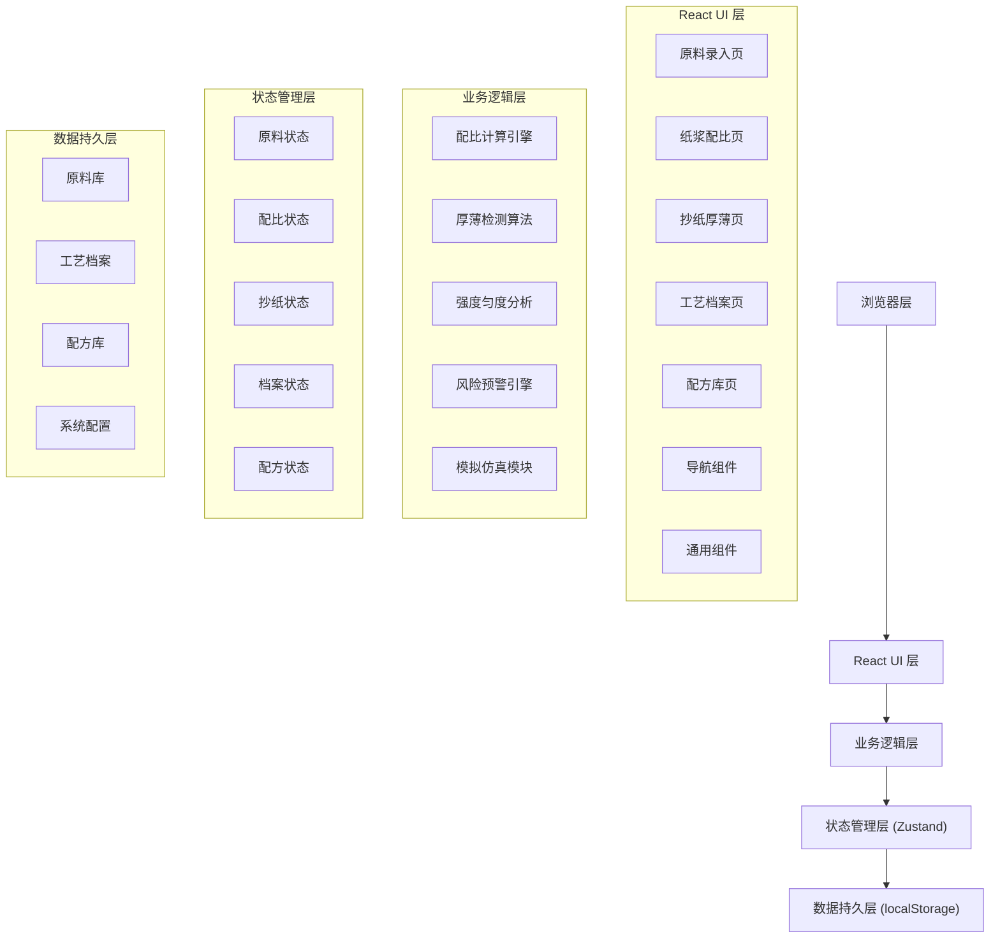
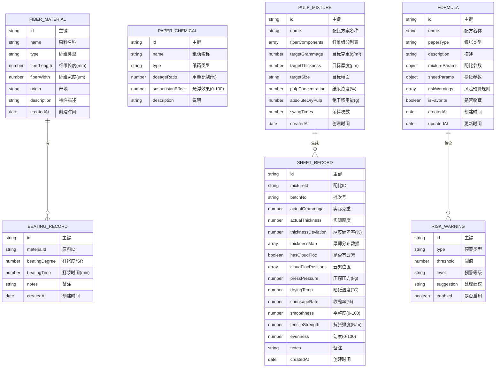
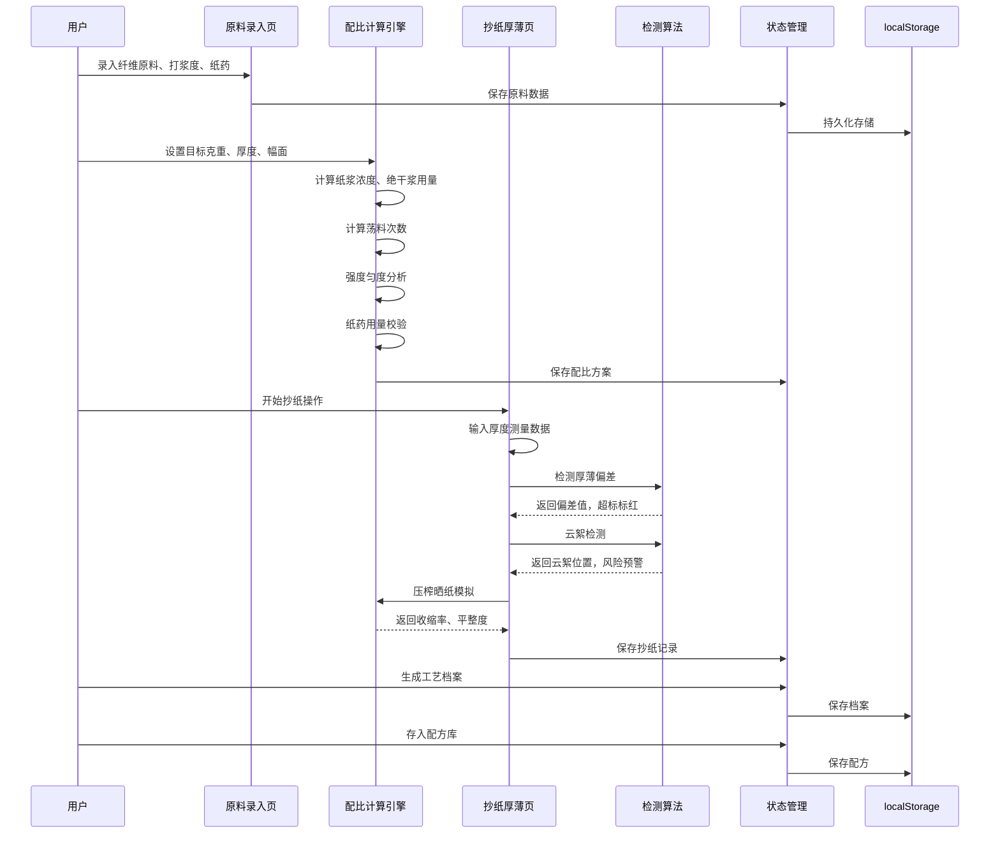

## 1. 架构设计

本系统采用纯前端单页应用架构，所有数据存储在浏览器本地，无需后端服务。使用 React 组件化开发，Zustand 进行状态管理，localStorage 持久化数据。



## 2. 技术描述

- **前端框架**: React@18 + TypeScript
- **构建工具**: Vite@5
- **状态管理**: Zustand@4
- **路由管理**: react-router-dom@6
- **样式方案**: TailwindCSS@3 + 自定义 CSS 变量
- **图标库**: lucide-react
- **图表库**: recharts (用于展示配比饼图、强度雷达图等)
- **数据持久化**: localStorage
- **初始化工具**: vite-init
- **后端**: 无（纯前端应用）
- **数据库**: 无（使用 localStorage 模拟）

## 3. 路由定义

| 路由路径 | 页面名称 | 功能说明 |
|----------|----------|----------|
| / | 原料录入页 | 首页，默认跳转到原料录入 |
| /materials | 原料录入页 | 纤维原料、打浆度、纸药参数录入管理 |
| /mixture | 纸浆配比页 | 目标参数设置、配比计算、反推优化 |
| /thickness | 抄纸厚薄页 | 荡料次数、厚薄检测、云絮识别、模拟 |
| /archives | 工艺档案页 | 批次记录、查询、追溯 |
| /formulas | 配方库页 | 配方存储、调用、对比、预警配置 |

## 4. 数据模型

### 4.1 数据模型定义



### 4.2 TypeScript 类型定义

```typescript
// 纤维原料
interface FiberMaterial {
  id: string;
  name: string;
  type: 'bark' | 'straw' | 'cotton' | 'bamboo' | 'hemp' | 'other';
  fiberLength: number;
  fiberWidth: number;
  origin: string;
  description: string;
  createdAt: string;
}

// 打浆记录
interface BeatingRecord {
  id: string;
  materialId: string;
  beatingDegree: number;
  beatingTime: number;
  notes: string;
  createdAt: string;
}

// 纸药
interface PaperChemical {
  id: string;
  name: string;
  type: 'mucilage' | 'fixative' | 'softener' | 'other';
  dosageRatio: number;
  suspensionEffect: number;
  description: string;
}

// 纸浆配比
interface FiberComponent {
  materialId: string;
  materialName: string;
  percentage: number;
  beatingDegree: number;
}

interface PulpMixture {
  id: string;
  name: string;
  fiberComponents: FiberComponent[];
  paperChemicalId: string;
  paperChemicalDosage: number;
  targetGrammage: number;
  targetThickness: number;
  targetWidth: number;
  targetHeight: number;
  pulpConcentration: number;
  absoluteDryPulp: number;
  swingTimes: number;
  createdAt: string;
}

// 抄纸记录
interface ThicknessPoint {
  x: number;
  y: number;
  thickness: number;
  deviation: number;
  isWarning: boolean;
}

interface CloudFloc {
  x: number;
  y: number;
  size: number;
  severity: 'mild' | 'moderate' | 'severe';
}

interface SheetRecord {
  id: string;
  mixtureId: string;
  batchNo: string;
  actualGrammage: number;
  actualThickness: number;
  thicknessDeviation: number;
  thicknessMap: ThicknessPoint[];
  hasCloudFloc: boolean;
  cloudFlocPositions: CloudFloc[];
  pressPressure: number;
  dryingTemp: number;
  shrinkageRate: number;
  smoothness: number;
  tensileStrength: number;
  evenness: number;
  riskAlerts: RiskAlert[];
  notes: string;
  createdAt: string;
}

// 风险预警
interface RiskAlert {
  id: string;
  type: 'flocculation' | 'uneven_thickness' | 'tearing' | 'excessive_shrinkage';
  level: 'info' | 'warning' | 'danger';
  message: string;
  suggestion: string;
  timestamp: string;
}

// 配方
interface Formula {
  id: string;
  name: string;
  paperType: string;
  description: string;
  mixtureParams: Omit<PulpMixture, 'id' | 'createdAt'>;
  sheetParams: Partial<SheetRecord>;
  riskWarnings: RiskAlert[];
  isFavorite: boolean;
  createdAt: string;
  updatedAt: string;
}

// 计算结果
interface CalculationResult {
  pulpConcentration: number;
  absoluteDryPulp: number;
  swingTimes: number;
  expectedStrength: number;
  expectedEvenness: number;
  estimatedShrinkage: number;
  warnings: string[];
}

// 应用状态
interface AppState {
  materials: FiberMaterial[];
  beatingRecords: BeatingRecord[];
  paperChemicals: PaperChemical[];
  mixtures: PulpMixture[];
  sheetRecords: SheetRecord[];
  formulas: Formula[];
  currentMixture: PulpMixture | null;
  currentSheet: SheetRecord | null;
}
```

## 5. 核心算法说明

### 5.1 纸浆浓度计算

```typescript
// 按目标克重计算纸浆浓度
// C = (G × S) / (1000 × η)
// C: 纸浆浓度(%)
// G: 目标克重(g/m²)
// S: 纸张面积(m²)
// η: 抄造效率系数(0.7-0.9)
function calculatePulpConcentration(
  targetGrammage: number,
  area: number,
  efficiency: number = 0.8
): number {
  return (targetGrammage * area) / (1000 * efficiency) * 100;
}
```

### 5.2 荡料次数计算

```typescript
// 根据浓度和目标厚度计算荡料次数
// N = (T × ρ) / (C × k)
// N: 荡料次数
// T: 目标厚度(μm)
// ρ: 纸层密度(g/cm³)
// C: 纸浆浓度(%)
// k: 单次荡料沉积系数
function calculateSwingTimes(
  targetThickness: number,
  concentration: number,
  density: number = 0.8
): number {
  const k = 0.12; // 经验系数
  return Math.ceil((targetThickness * density) / (concentration * k));
}
```

### 5.3 厚度偏差检测

```typescript
// 检测厚薄偏差，超过阈值标红
function detectThicknessDeviation(
  measurements: number[],
  target: number,
  threshold: number = 10
): { deviation: number; isWarning: boolean }[] {
  return measurements.map(m => {
    const deviation = Math.abs((m - target) / target * 100);
    return {
      deviation,
      isWarning: deviation > threshold
    };
  });
}
```

### 5.4 强度匀度分析

```typescript
// 计算纤维长度与打浆度对强度的影响
function calculateStrength(
  fiberLength: number,
  beatingDegree: number,
  fiberRatio: number
): number {
  // 强度指数，0-100
  const lengthFactor = Math.min(fiberLength / 3, 1) * 40;
  const beatingFactor = Math.min(beatingDegree / 60, 1) * 35;
  const ratioFactor = fiberRatio * 25;
  return Math.round(lengthFactor + beatingFactor + ratioFactor);
}
```

### 5.5 纸药校验

```typescript
// 校验纸药用量对纤维悬浮的作用
function validatePaperChemical(
  dosage: number,
  pulpConcentration: number,
  fiberLength: number
): { isValid: boolean; message: string; suggestion: string } {
  const optimalDosage = 0.3 + pulpConcentration * 0.02 + fiberLength * 0.05;
  const ratio = dosage / optimalDosage;
  
  if (ratio < 0.5) {
    return {
      isValid: false,
      message: '纸药用量不足，纤维悬浮效果差',
      suggestion: `建议增加用量至 ${optimalDosage.toFixed(2)}% 左右`
    };
  } else if (ratio > 2) {
    return {
      isValid: false,
      message: '纸药用量过多，可能影响揭纸',
      suggestion: `建议减少用量至 ${optimalDosage.toFixed(2)}% 左右`
    };
  }
  return {
    isValid: true,
    message: '纸药用量合理',
    suggestion: '保持当前用量'
  };
}
```

### 5.6 压榨晒纸模拟

```typescript
// 模拟压榨与晒纸对成纸的影响
function simulatePressDrying(
  pressPressure: number,
  dryingTemp: number,
  initialThickness: number
): { 
  finalThickness: number; 
  shrinkageRate: number; 
  smoothness: number;
  riskOfCracking: boolean;
} {
  const pressEffect = Math.max(0.6, 1 - pressPressure * 0.008);
  const dryingEffect = 1 - Math.min(dryingTemp - 20, 60) * 0.003;
  const finalThickness = initialThickness * pressEffect * dryingEffect;
  const shrinkageRate = (1 - pressEffect * dryingEffect) * 100;
  const smoothness = Math.min(100, 40 + pressPressure * 0.5 + dryingTemp * 0.3);
  const riskOfCracking = dryingTemp > 60 && pressPressure > 30;
  
  return { finalThickness, shrinkageRate, smoothness, riskOfCracking };
}
```

## 6. 项目结构

```
src/
├── components/          # 公共组件
│   ├── Layout.tsx       # 布局组件
│   ├── Sidebar.tsx      # 侧边导航
│   ├── Header.tsx       # 顶部标题
│   ├── Card.tsx         # 宣纸质感卡片
│   ├── Slider.tsx       # 滑块组件
│   ├── Button.tsx       # 按钮组件
│   ├── Alert.tsx        # 预警提示组件
│   └── NumberRoll.tsx   # 数字滚动动画
├── pages/               # 页面组件
│   ├── Materials.tsx    # 原料录入页
│   ├── Mixture.tsx      # 纸浆配比页
│   ├── Thickness.tsx    # 抄纸厚薄页
│   ├── Archives.tsx     # 工艺档案页
│   └── Formulas.tsx     # 配方库页
├── store/               # 状态管理
│   └── useAppStore.ts   # Zustand store
├── utils/               # 工具函数
│   ├── calculations.ts  # 计算引擎
│   ├── detection.ts     # 检测算法
│   ├── simulation.ts    # 模拟仿真
│   ├── storage.ts       # 本地存储
│   └── validation.ts    # 参数校验
├── types/               # 类型定义
│   └── index.ts         # 所有TS类型
├── data/                # 模拟数据
│   └── mockData.ts      # 初始演示数据
├── App.tsx              # 根组件
├── main.tsx             # 入口文件
└── index.css            # 全局样式
```

## 7. 核心业务流程


